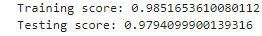
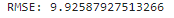
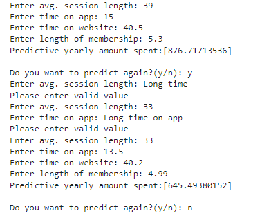

# Ecommerce_Expenses_Prediction
This project helps us predict yearly amount spent by using linear regression model.

Used libraries:

-Numpy
- Pandas
- Seaborn
- Matplotlib
- Sklearn
- Joblib
- Warnings

# Training and Testing Score

# RMSE

# Deployment

